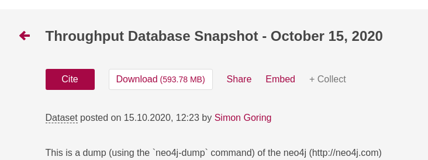
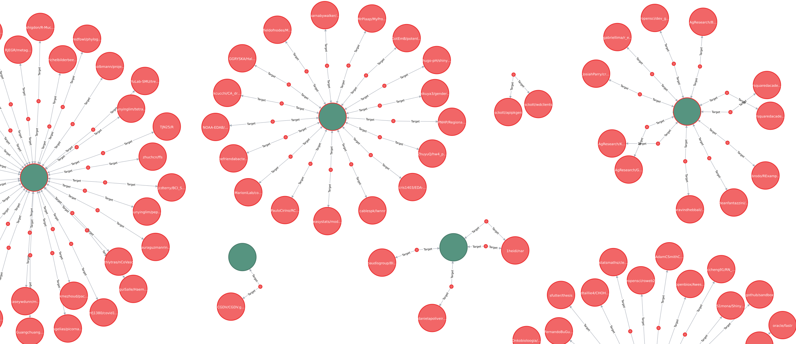

# Cloning the Throughput Database

The Throughput Database is a live database, that is continually updated with user-created annotations and operations that clean and optimize the graph structure.  Database snapshots are made available on a semi-regular basis and can be accessed through the [Throughput Snapshot Collection](https://doi.org/10.6084/m9.figshare.c.5075912.v1) on figShare.

## Download the File

The Throughput snapshots are saved as `tar.gz` compressed files.  A number of programs exist to unzip these files on Windows, Mac or Linux operating systems.  Select one of the snapshots within the [Collection](https://doi.org/10.6084/m9.figshare.c.5075912.v1) and download the file to your computer.



## Using neo4j Desktop

The file within the `tar.gz` archive is a [neo4j dump file](https://neo4j.com/docs/operations-manual/current/tools/dump-load/).  If you do not have neo4j installed, you must do that first (see [Installing neo4j](https://neo4j.com/docs/operations-manual/current/installation/)).

Once neo4j is installed:

1.  Start **Neo4j desktop** and create a new local database.
2.  Click on the `...` icon on the top right of the database panel, and select **Manage**.
3.  Click the "Open Folder" button to open the directory of the database.
4.  Move the `.dump` file to an appropriate location in this directory.
5.  In the **Manage** window, click the **Open Terminal** button.
6.  In the terminal, use the following command:

```
bin/neo4j-admin load --from=<archive-path> --database=<database-name> --force
```

Where the `<archive-path>` is the path of the `.dump` file and `<database-name>` is the type of the new database that you are loading into (in this case, a `neo4j` database).  There may be some difference between Windows and Linux-based operating systems in the use of forward and backslashes.  As an example, if I placed the file `neo4j.dump` into the `data/backups` directory of the database, I could load it with the following command:

```
bin\neo4j-admin load --from=data/backups/neo4j.dump --database=neo4j --force
```

7.  Start the database. It should populate with the data.

See also the official Neo4j page on dumping and loading database snapshots [here](https://neo4j.com/docs/operations-manual/current/tools/dump-load/).


