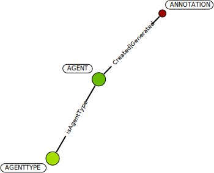

# AGENTs



Agents are the people or things that do the work of creating `ANNOTATION`s in the Throughput Annotation Database.  An agent may be a person, software, an organization, or may be another `AGENTTYPE` that is either undefined, or that is to be implemented.  An agent can `Create` or `Generate` an annotation.  The difference being that `Generated` annotations are programmatically produced, and as such should be limited to `AGENT`s with the `AGENTTYPE` property `{type:SoftwareAgent}`.

We can search for `ANNOTATION`s generated by specific `AGENT`s, or that reference `OBJECTS` associated with individuals or pieces of software.  For example, we may want to find all annotations generated by the Throughput Widget API, or all annotations by a graduate student who had been working with a particular database.

## Matching `AGENT`s

Matching an `AGENT` is fairly straightforward.  We can match:

```
MATCH (ag:AGENT)
WHERE ag.name CONTAINS('Simon')
RETURN properties(ag)
```

At the time of writing, this returns 360 separate records of individuals.  From that point we can make more complex queries, for example, counting the number of annotations each of those individuals is associated with:

```
MATCH (ag:AGENT)
WHERE ag.name CONTAINS('Simon')
WITH ag
MATCH (ag)-[:Created]->(an:ANNOTATION)
RETURN ag.name, COUNT(DISTINCT an)
```

At this time, only one individual named `Simon` has contributed annotations.

# AGENTTYPEs
