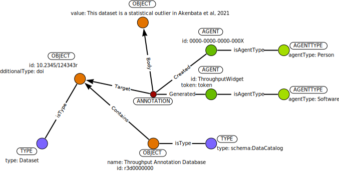

# New Annotations

New annotations can be added by users using an API.  We can add annotations in several ways.  A user can use the [Throughput Widget]() on a data repository website to annotate a particular data object, or dataset.  An individual may add an annotation to link a data repository to a particular code repository, or may create an annotation that adds additional information to a particular element within the Throughput annotation graph (for example, a description, keyword or subject to an object).

## Annotating a Dataset

### curl Request

```
curl -d '{dbid: 'r3d0000000', orcid: '0000-0000-0000-000X', additionalType: 'doi', id: '10.00000/00000000', body: 'This dataset is considered to be an outlier in Akenbata et al., 2021', token: 'XXXXXXX'}' -H 'Content-Type: application/json' https://throughputdb.com/api/widget
```

The dataset annotation API is a `POST` method that accepts the following parameters:
`dbid`, the unique database identifier; `orcid`, the user ORCID (for the user making the request), `additionalType`, this is a parameter that is implemented by the database on which the user is making the `POST` request, to identify at which level the annotation is being made, this is to account for potentially overlapping identifiers; `id`, the object identifier, associated with the `additionalType` and `dbid`; `body`, the text that us to be used to annotate the object, for example, *"This dataset is considered to be an outlier in Akenbata et al., 2021"*; `token`, the unique alphanumeric token that is associated with a particular database for use with the Annotation Widget.



In the figure above we can see that there are two `AGENT` elements, one is the Widget software that was used to post the annotation, and the particular instance of this widget is identified by the token passed in the `POST` request.  The second `AGENT` is the individual making the annotation, identified using their ORCID.  The `OBJECT` of `TYPE` `Dataset` is `Contain`ed within the `OBJECT` of `TYPE` `schema:DataCatalog`, identified by the `dbid` passed to the `POST` method.

The API call thus accounts for all elements needed to generate the graph for this particular annotation.
