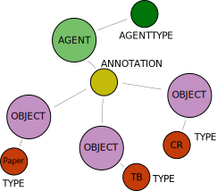
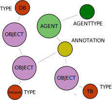

# Data Models

Currently there are several models for relationships within Throughput:

*   Data Use and Reuse
    *   Databases linked to code repositories
    *   Papers linked to GitHub code repositories
    *   Text annotations linked to datasets (linked to databases)
*   Credit tracking
    *   Grants linked to databases
    *   Grants linked to code repositories
    *   Grants linked to papers

## Data Use and Reuse

Throughput aims to help people find ways to use data that meet their needs as
a researcher.  For example, we want to help early-career researchers find ways
to undertake multidisciplinary analysis that combines climate data and information
about land use.  To do this, a student must find the appropriate data resources
and then understand how to undertake analysis on these resources.

### Data(base)-to-Code Connections

A research database may have many uses, through APIs, direct data downloads, or
SQL connections to the databases. Throughput links to each repository that uses
a particular data resource.  This code is publicly available at the Throughput
[re3 scraper repository](https://github.com/throughput-ec/github_scrapers/tree/master/re3scraper).

Using `schema:DataCatalog` `OBJECT` nodes we can create an annotation that
links to a `schema:CodeRepository` `OBJECT`.  The `ANNOTATION` node
identifies the link between the two records, and can be supplemented with an
`OBJECT` node of `TYPE` *TextualBody*.  This last object has an explanation
of why the annotation was made.

The annotation includes information about the `AGENT` that has generated the
annotation.  This may include either an individual who created the specific annotation,
or a set of annotations generated programatically.  The `AGENT` can be
identified using the `AGENTTYPE`.


#### Sample Query

```coffeescript
# Search for all code repositories linked to a database:
MATCH (n:OBJECT)-[:isType]-(:TYPE {type:"schema:DataCatalog"})
  WHERE n.name CONTAINS "searchTerm"
  MATCH (o:OBJECT)-[:isType]-(:TYPE {type:"schema:CodeRepository"})
  WITH n, o
  MATCH p=(n)-[]-(:ANNOTATION)-[:Target]-(o)
  RETURN p
  LIMIT 10
```

## Paper-to-Code Connections

Research papers contain detailed methodologies that are supported by peer reviewed
literature.  This supporting information may be lost when users rely only on
the code.  By linking code in code repositories to published articles, and the
published articles to the code repositories, we make both more discoverable, and
provide a clear link, and attribution to the citation itself.



Using `schema:Article` `OBJECT` nodes we can create an annotation that
links to a `schema:CodeRepository` `OBJECT`.  The `ANNOTATION` node
identifies the link between the two records, and can be supplemented with an
`OBJECT` node of `TYPE` *TextualBody*.  This last object has an explanation
of why the annotation was made.

The annotation includes information about the `AGENT` that has generated the
annotation.  This may include either an individual who created the specific annotation,
or a set of annotations generated programatically.  The `AGENT` can be
identified using the `AGENTTYPE`.

### Sample Query

```coffeescript
  # Search for all code repositories linked to a database:
  MATCH (n:OBJECT)-[:isType]-(:TYPE {type:"schema:Article"})
            WHERE n.doi CONTAINS "10.1002/ecy.2856"
            MATCH (o:OBJECT)-[:isType]-(:TYPE {type:"schema:CodeRepository"})
            WITH n, o
            MATCH p=(n)-[]-(:ANNOTATION)-[:Target]-(o)
            RETURN p
            LIMIT 10
```

## Text-to-Dataset Connections

Research papers contain detailed methodologies that are supported by peer reviewed
literature.  This supporting information may be lost when users rely only on
the code.  By linking code in code repositories to published articles, and the
published articles to the code repositories, we make both more discoverable, and
provide a clear link, and attribution to the citation itself.



Using `schema:Dataset` `OBJECT` nodes we can create an annotation that
links to a `TextualBody` `OBJECT`.  The `ANNOTATION` node
identifies the link between the two records.  This last object has an explanation
of why the annotation was made.

The annotation includes information about the `AGENT` that has generated the
annotation.  This may include either an individual who created the specific annotation,
or a set of annotations generated programatically.  The `AGENT` can be
identified using the `AGENTTYPE`.


## Credit Tracking
