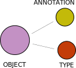

# OBJECTs


Objects are the powerhouse of Throughput.  They are the elements that are linked
by annotations.  The main object classes in Throughput are grants, code repositories
and databases.  Objects are defined by `TYPE` classes.  A `TYPE`
is defined either through the types defined in the W3C Annotation documentation, or
by a set of definitions from [schema.org](http://schema.org/).

All objects have a unique ID (imposed by neo4j), and may have a second ID that is defined by the object type.



An `OBJECT` in the database may be connected to a TYPE (`isType`) or an ANNOTATION (`body` or `target`).

## TYPEs

`TYPE` is a property of an `OBJECT` but in practice it is defined as a separate
node within the Neo4j database to allow us to improve flexibility of the underlying data model.  As such, we can find (for example) a database using:

```
  MATCH (n:OBJECT)-[:isType]-(:TYPE {type:'schema:DataCatalog'})
  RETURN n
  LIMIT 3
```

The `TYPE` defining an object also defines some of the properties that the object may have, although these are not embedded as constraints.

### schema:DataCatalog

Objects defined as data catalogs were initially scraped from [re3data.org](http://re3data.org) using a
script that has been stored on GitHub in a `code repository <http://https://github.com/throughput-ec/throughputdb/tree/master/Re3Databases>`_.

The object has properties:

*   `id`, which come from the unique identifier (DOI) assigned by re3data.
*   `name` is the official name of the database.
*   `url` is the URL link for the database.
*   `keywords` is an array of terms associated with the database (although see `keywords`)
*   `description` is the description given to the database.

An object is represented by the cypher statement:

```
  (ob:OBJECT {id: "10.17616/R3PD38",
              name: "Neotoma Paleoecology Database",
              url: "http://neotomadb.org",
              keywords: ["paleoenvironments", "fossil mammals (FAUNMAP)"],
              description: "Neotoma is a multiproxy paleoecological database that
              covers the Pliocene-Quaternary . . ."})
```

Individual databases have keywords associated with them. In some cases keywords
may be misspelled, or may be either too general ("science") or too specific
("holocene fossils"). To ensure that keywords can be used effectively we want
to add them to the graph.

We do this by creating a special node type (KEYWORD), with the constraint that
each keyword is unique. Keywords may be related using the :implies relationship.

Each `KEYWORD` is related to an `OBJECT` through annotations.

### schema:CodeRepository

Objects of type `schema:CodeRepository` were originally scraped from GitHub, with code that is found in the
[github_scrapers](https://github.com/throughput-ec/github_scrapers) repository.

The objects have the properties:

*   `id` which is the repository assigned ID (a numeric identifier in the case of GitHub)
*   `name` The name of the repository is a combination of the repository owner and the repository name.
*   `description` A user provided description for the repository.
*   `url` The URL for the repository.

```
  MERGE (ob:OBJECT {id: 1234456,
                    url: "http://github.com/SimonGoring/myrepo",
                    description: "This repo is the bomb of bombs.",
                    name: "SimonGoring/myrepo"})
```

Code repositories may have keywords assigned, or have keywords defined (topics
in the terminology of GitHub).  These are linked to KEYWORD objects in the
database through an ANNOTATION.

### schema:Article

A scientific journal article type is a simplification of the [CrossRef data schema v0.1.1](https://gitlab.com/crossref/schema/-/releases/0.1.1).
The schema for OBJECTs of type `schema:Article` provides fields for journal, title, author, and URL.  The field `id` is used for the DOI, to keep a standard of unique IDs in the `id` field.

*   `id` - Unique identifier for grants (assumes NSF grants)
*   `journal`
*   `title`
*   `author`
*   `url`

```
MERGE (award:OBJECT {"journal": "Risk Analysis",
                     "id": "10.1111/risa.13567",
                     "title": "Protecting From Malware Obfuscation Attacks Through Adversarial Risk Analysis",
                     "url": "https://onlinelibrary.wiley.com/doi/abs/10.1111/risa.13567",
                     "authors": "Redondo, Alberto; Insua, David Ríos"})
```

### schema:Grant

The structure of a grant is (currently) based on the NSF Award schema.  The code to
obtain the NSF awards and add them to the graph is located within the Throughput
database [nsf_award](https://github.com/throughput-ec/throughputdb/tree/master/nsf_awards)
module.

*   `AwardID` - Unique identifier for grants (assumes NSF grants)
*   `name`
*   `amount`
*   `ARRAAmount`
*   `AwardInstrument`
*   `description`

```
MERGE (award:OBJECT {AwardID: 1234567,
                     name: "Award name",
                     amount: 12345,
                     ARRAAmount: 12345,
                     AwardInstrument = "Award Thing",
                     description = "The abstract of our grant proposal."})
```


## Constraints & Indexes

Object ids must be unique & are indexed:

```
  CREATE CONSTRAINT ON (o:OBJECT) ASSERT o.id IS UNIQUE;
  CREATE INDEX objName FOR (n:OBJECT) ON (n.name)
```

Object names are indexed

```
  CREATE INDEX objName FOR (n:OBJECT) ON (n.name)
```

There is a fulltext index on the `name` and `description`:

```
  CALL db.index.fulltext.createNodeIndex("nameAndDesc",
                                         ["OBJECT"],
                                         ["name", "description"])
```
