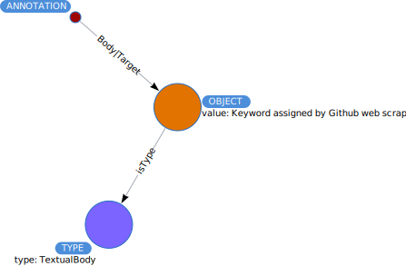

# OBJECTs

Objects are the powerhouse of Throughput.  They are the elements that are linked
by annotations.  The main object classes in Throughput are grants, code repositories
and databases.  Objects are defined by `TYPE` classes.  A `TYPE`
is defined either through the types defined in the W3C Annotation documentation, or
by a set of definitions from [schema.org](http://schema.org/).

All objects have a unique ID (imposed by neo4j), and may have a second ID that is defined by the object type.



An `OBJECT` in the database may be connected to a `TYPE` (`isType`) or an ANNOTATION (`Body` or `Target`).

### Matching Objects

An `OBJECT` may have one or more properties, not all `OBJECT`s have the same properties.  For example, a `TextualBody` object will (most likely) not have a `doi` associated with it.  Some common properties of `OBJECT`s are `url`s, `id`s, and `name` elements.  A simple `OBJECT` match may be:

```
MATCH (o:OBJECT)
WHERE o.name CONTAINS('Neotoma')
RETURN o
```

### Constraints & Indexes

Object ids must be unique & are indexed:

```
  CREATE CONSTRAINT ON (o:OBJECT) ASSERT o.id IS UNIQUE;
  CREATE INDEX objName FOR (n:OBJECT) ON (n.name)
```

Object names are indexed

```
  CREATE INDEX objName FOR (n:OBJECT) ON (n.name)
```

There is a fulltext index on the `name` and `description`:

```
  CALL db.index.fulltext.createNodeIndex("nameAndDesc",
                                         ["OBJECT"],
                                         ["name", "description"])
```
